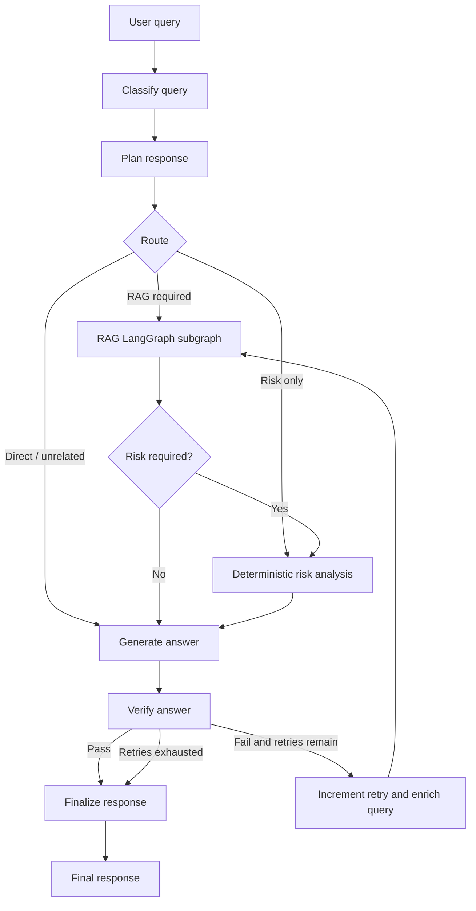
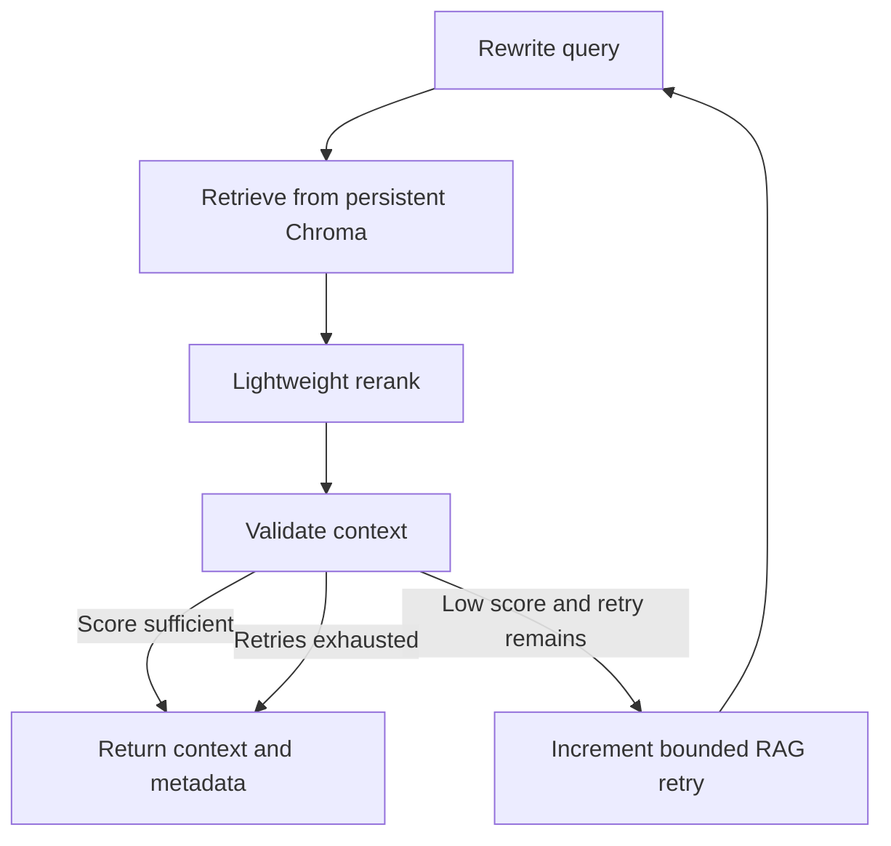

# Cybersecurity Incident Response Agent

A production-minded take-home prototype of a **local-first Agentic RAG assistant** for defensive cybersecurity incident response. It classifies an incident, creates a focused plan, chooses whether to retrieve procedures and calculate risk, executes a dedicated RAG subgraph, drafts a sourced response, verifies it, and performs bounded recovery when grounding is insufficient. No paid API is required.

> This is demonstration software and the included original knowledge base is not authoritative legal, regulatory, or professional cybersecurity guidance. Do not send secrets or unnecessary personal data to the model.

## Problem and user need

Responders combine a user's incomplete incident description with procedural material under time pressure. Phishing, ransomware, suspicious logins, credential theft, and data exposure do not require identical workflows. A plain “chat with documents” pipeline retrieves on every turn and asks the model to make every decision; that is both wasteful and difficult to validate.

Agentic RAG fits because the workflow can autonomously determine the incident type, retrieval and risk needs, execution tasks, context sufficiency, and response grounding. RAG anchors recommendations in known procedures, while deterministic tools handle numerical risk instead of delegating arithmetic and business rules to an LLM.

## Architecture



The main graph has eight meaningful nodes:

1. `classify_query` uses Pydantic-validated output for intent, incident type, severity, confidence, and routing flags. Malformed output falls back safely.
2. `plan_response` decomposes the task into only the required retrieval, risk, and response steps.
3. `execute_knowledge_retrieval` invokes a separately compiled RAG graph and maps its result into main state.
4. `risk_analysis` lets the model extract explicit factors, but deterministic Python computes the score.
5. `generate_answer` supplies the original query, plan, retrieved evidence, risk, and an allow-list of real sources.
6. `verify_answer` produces grounding/completeness scores and actionable feedback through a structured schema.
7. `increment_agent_retry` changes the retrieval query using verifier feedback and enforces `MAX_AGENT_RETRIES`.
8. `finalize_response` adds context/verification warnings and the responsible-use notice when appropriate; it is not a pass-through.

State is an explicit `TypedDict` containing classification, plan, routing flags, retrieval artifacts, risk inputs/result, draft, verification, bounded counters, errors, trace, and per-stage timings. Nodes return focused partial updates. The trace makes decisions visible in Streamlit without introducing a distributed tracing system.

### RAG subgraph



The rewrite preserves commands and indicators while adding defensive intent. Chroma returns content, similarity, filename/path/title, optional PDF page, and stable chunk ID. A lightweight secondary rank blends vector similarity (65%) with query-token overlap (35%); set `ENABLE_RERANKER=false` to retain vector order. This avoids a cross-encoder's memory cost and latency on consumer hardware.

Context validation averages the top reranked scores and applies a small multi-document coverage bonus. `CONTEXT_THRESHOLD` controls bounded rewriting. It is intentionally described as a prototype confidence heuristic—not a calibrated probability or scientific groundedness metric.

## Retrieval design and trade-offs

- **Ingestion is separate from startup.** `python -m app.rag.ingestion` loads Markdown, text, and PDF; startup never rebuilds embeddings.
- **Chunking defaults to 850 characters with 120 overlap.** This is enough for compact operational steps while retaining nearby qualifiers across boundaries. It is a starting point for these concise documents, not a universal optimum. Paragraph/sentence boundaries are preferred where practical.
- **Embeddings default to `BAAI/bge-small-en-v1.5`.** It is a strong, compact English retrieval model suitable for CPU use and consumer GPUs. A larger embedding model may improve semantic recall at greater download, RAM, and latency cost. Configure `EMBEDDING_MODEL` before ingestion; re-ingest after changing it.
- **Chroma** provides simple local persistence and metadata filtering with minimal infrastructure. It is well suited to a prototype, though a larger deployment would need explicit backup, multi-tenancy, access controls, and operational scaling.
- **Source correctness** comes from retrieval metadata. Generation receives an allow-list, and code appends actual retrieved sources when a model omits the section. No source is invented.

The included 15 original demo documents cover overview, phishing, malware, dedicated PowerShell triage, ransomware, credential compromise, MFA takeover, suspicious login, data breach, unauthorized access, endpoint containment, evidence, recovery, and escalation. Key procedures include Hungarian retrieval aliases for bilingual incident descriptions. They are clearly marked as prototype material.

## Tools and risk scoring

`KnowledgeSearchTool` executes local vector search. `calculate_incident_risk` is a non-retrieval deterministic tool. Its additive factors and weights are:

| Factor | Weight |
|---|---:|
| Malware execution | 20 |
| Privileged account | 20 |
| Sensitive data exposed | 30 |
| External access | 15 |
| Credential compromise | 20 |
| Lateral movement | 25 |
| Critical asset | 20 |
| Ransomware indicators | 70 |

Scores are capped at 100: 0–19 Low, 20–39 Medium, 40–69 High, and 70–100 Critical. The result lists contributing factors and explains the score. This is transparent triage prioritization, not a replacement for an organization's impact methodology.

## LLM and grounding design

The `LLMProvider` interface separates text and Pydantic-structured generation. `OllamaProvider` implements it using Ollama's local chat endpoint and JSON-schema format. `OLLAMA_MODEL` defaults to `qwen3:8b`, a capable instruct model that can be quantized for approximately 8 GB VRAM; model size, quantization, context, and concurrent load determine actual memory. `OLLAMA_NUM_CTX` defaults to 8192 to prevent very-long-context model defaults from spilling unnecessarily into system RAM. `OLLAMA_NUM_PREDICT=1024` bounds answer length, `OLLAMA_TIMEOUT_SECONDS` defaults to 600 for slower CPU-only inference, and `OLLAMA_THINK=false` disables Qwen's hidden reasoning mode to keep interactive response times bounded. Change these settings without modifying graph nodes. `FakeLLMProvider` is deterministic and restricted to tests, offline evaluation, and development—not silently substituted into the Streamlit app.

Grounding mitigations include source allow-listing, context and retrieval scores, structured verification, required operational sections, bounded query recovery, explicit uncertainty, and safe finalization after retry exhaustion. The model can still misunderstand evidence; a trained responder must validate consequential actions.

## Quick start (Python 3.11 or 3.12)

Ollama must be installed and running. From the repository root:

```powershell
Copy-Item .env.example .env
python -m venv .venv
.\.venv\Scripts\Activate.ps1
python -m pip install -e ".[dev]"
ollama pull qwen3:8b
python -m app.rag.ingestion
python -m streamlit run app/ui/streamlit_app.py
```

On Bash, use `cp .env.example .env` and `source .venv/bin/activate`. If the model is unavailable or too large, set `OLLAMA_MODEL` in `.env` (for example another Ollama instruct model), pull that exact tag, and restart Streamlit. Changing the embedding model requires a clean collection or a different `CHROMA_PATH` followed by ingestion.

Health status in the sidebar distinguishes an unreachable Ollama server, a missing configured model, and an empty vector collection, and gives the exact remediation command.

The bundled `.streamlit/config.toml` disables Streamlit's source-file watcher. This avoids the watcher probing Transformers' optional image/video modules and producing irrelevant `torchvision` import errors; the application uses text embeddings only. Restart Streamlit manually after changing Python source code.

### Commands

| Purpose | Make | PowerShell without Make |
|---|---|---|
| Install | `make install` | `python -m pip install -e ".[dev]"` |
| Ingest | `make ingest` | `python -m app.rag.ingestion` |
| Run UI | `make run` | `python -m streamlit run app/ui/streamlit_app.py` |
| Test | `make test` | `python -m pytest` |
| Lint | `make lint` | `python -m ruff check .` |
| Evaluate | `make evaluate` | `python -m evaluation.evaluate` |
| Load test | `make load-test` | `python -m load_tests.load_test --requests 100` |

Run one deterministic offline graph query with:

```powershell
python -m app.main --fake-llm "A Word attachment launched PowerShell"
```

## Docker Compose

```powershell
docker compose up --build -d
docker compose exec ollama ollama pull qwen3:8b
docker compose exec app python -m app.rag.ingestion
```

Open <http://localhost:8501>. Model pulling is intentionally explicit because automatic multi-gigabyte downloads make startup unreliable. Named volumes retain Ollama models, the Hugging Face embedding cache, and Chroma data. Stop with `docker compose down`; add `-v` only when you intentionally want to delete those persistent volumes.

## Testing and evaluation

The deterministic test suite needs no GPU or running Ollama. It covers risk boundaries/capping, routing and retry limits, typed state updates, source metadata, context validation, configuration, schema rejection, RAG compilation/execution, main-graph paths, and document ingestion into temporary Chroma.

`python -m evaluation.evaluate` executes **exactly 15** cases using FakeLLM plus real local embeddings/Chroma. Add `--real-llm` for a configured Ollama run. It writes JSON and CSV and measures classification accuracy, retrieval hit rate, concept coverage, source correctness, risk agreement, a verifier groundedness heuristic, and end-to-end success. Metrics are computed from outputs, never hardcoded. Generated results are ignored by Git.

`python -m load_tests.load_test --requests 100` supports 50–200 queries, performs one reported but unmeasured model warm-up, and records success/errors, min/max/mean/median/p95/p99 latency, throughput, wall time, and mean classification/retrieval/generation/verification timings in JSON/CSV. Its default FakeLLM result does **not** represent Ollama inference. Use `--real-llm --workers 1` for a conservative real-model benchmark.

### Functional evaluation results

The latest evaluation was run on 2026-09-03 against the current 15-case dataset. It used the deterministic FakeLLM for reproducible classification, planning, generation, and verification while retaining the real `BAAI/bge-small-en-v1.5` embedding model and persistent Chroma retrieval. Consequently, the results test graph logic, routing, retrieval, source handling, deterministic risk scoring, and answer-property checks; they do not measure the linguistic quality or latency of Qwen through Ollama.

| Metric | Result |
|---|---:|
| Questions | 15 |
| Classification accuracy | 100.0% |
| Retrieval hit rate | 100.0% |
| Risk-level agreement | 86.7% |
| Required-concept coverage | 95.6% |
| Source correctness | 100.0% |
| Groundedness heuristic | 85.0% |
| End-to-end success rate | 86.7% (13/15) |

The two end-to-end failures are `containment_01` and `general_01`. Both are general guidance questions for which the workflow intentionally skips incident risk calculation, while the current evaluation records expect a Low or Medium risk. Their classification and retrieval are correct, but the missing risk value fails the shared success predicate. This exposes an evaluation-contract mismatch rather than a retrieval failure. A future revision should make risk optional for non-incident questions and report risk agreement only over cases that request risk analysis.

The remaining retrieval and source metrics show that every case returned at least one expected procedure and that cited filenames came from retrieved metadata. The 95.6% concept coverage shows that most expected response concepts were present, but the small, synthetic dataset and deterministic generator make these development-regression metrics rather than evidence of production accuracy. A stronger evaluation would add Hungarian cases, adversarial and ambiguous inputs, human review, and a separate Ollama run.

### Load-test results and bottleneck analysis

The latest load scenario was run on 2026-09-03 on Windows 11 Pro, an AMD Ryzen 7 260 host, and 31.3 GB RAM. The command was `python -m load_tests.load_test --requests 100`, which uses four worker threads by default. It used FakeLLM, real local embeddings, and Chroma. One 16.98-second model/index warm-up was deliberately excluded from the measured request window.

| Metric | Result |
|---|---:|
| Requests | 100 |
| Successful / failed | 100 / 0 |
| Error rate | 0.0% |
| Minimum latency | 86 ms |
| Mean latency | 143 ms |
| Median latency | 139 ms |
| p95 latency | 177 ms |
| p99 latency | 240 ms |
| Maximum latency | 282 ms |
| Throughput | 27.73 queries/second |
| Measured wall time | 3.61 seconds |

Average retrieval time was 136.6 ms, compared with 0.46 ms for verification, 0.16 ms for generation, and less than 0.14 ms for the other recorded stages. Retrieval therefore accounts for approximately 95.6% of mean end-to-end latency and is the clear bottleneck in this deterministic scenario. The unmeasured 16.98-second first-use warm-up is a separate startup bottleneck caused primarily by loading the embedding model and opening the vector index.

Two concrete optimizations follow from these measurements:

1. Cache embeddings and final retrieval results for repeated normalized queries, and keep the embedding model plus Chroma client alive for the lifetime of the application. This targets both repeated-query latency and cold-start cost.
2. Benchmark a smaller candidate set and lower `TOP_K`, then skip or simplify reranking when the leading retrieval score is already above a validated threshold. This reduces vector-result processing while preserving bounded fallback retrieval for uncertain cases.

These optimizations must be validated with before/after runs on the same hardware and workload. With `--real-llm`, generation and verification are expected to dominate instead, so the real Ollama path must be benchmarked separately before drawing production-capacity conclusions.

## UI

The Streamlit chat shows final guidance and expanders for the node-by-node execution trace, timing, retrieved chunks and scores, deterministic risk result, and safe debug data. It never displays environment values or secrets. Chat history remains in the current browser session.

## Repository structure

```text
app/
  agent/          typed state, schemas, routing, nodes, main graph
  llm/            provider interface, Ollama, deterministic FakeLLM
  prompts/        readable prompt templates
  rag/            loaders, chunking, embeddings, Chroma, rerank, RAG graph
  tools/          knowledge search and deterministic risk calculator
  ui/             Streamlit application
data/knowledge_base/  original demonstration procedures
evaluation/       exactly 15 cases, metrics, runner
load_tests/       configurable 50–200 query runner
tests/            unit and integration tests
results/          generated machine-readable measurements (ignored)
storage/          persistent Chroma data (ignored)
```

## Performance and optimization

Node-level timings are retained in agent state and displayed in the UI, so bottlenecks can be identified from measurements rather than assumptions. The current deterministic benchmark identifies retrieval as the steady-state bottleneck and embedding initialization as the cold-start bottleneck. For a real local LLM run, additional candidates include a smaller or more aggressively quantized Ollama model, reduced context size, and avoiding unnecessary verification calls. Ingestion already batches 64 chunks. No optimization should be claimed as an improvement until before/after measurements use the same hardware, model, vector collection, concurrency, and workload.

## Security considerations and limitations

- This is a single-user prototype without authentication, authorization, tenant isolation, encryption key management, or audit-log export.
- Retrieved documents and user text are untrusted input. Prompts restrict scope, but production needs document provenance, approval workflows, prompt-injection defenses, and output policy controls.
- Chroma and Ollama data stay local by default, but host/container access and backups remain the operator's responsibility.
- Never paste live secrets; redact personal and regulated data. Logs intentionally omit retrieved bodies and prompts.
- Risk weights and confidence thresholds require organizational calibration. The verifier is not a human judge.
- Legal notification, evidence handling, system shutdown, and business-impact decisions require authorized professionals.
- The small English demo corpus does not cover every product, jurisdiction, or incident.

Future work includes authenticated case workspaces, approval gates for high-impact actions, richer indicator extraction, hybrid keyword/vector retrieval, document trust tiers, observability export, human evaluation, multilingual embeddings, calibrated scores, and organization-specific playbook connectors.

## Example questions

- “A user opened a Word attachment and PowerShell flashed. What should we do now?”
- “An impossible-travel sign-in was followed by a new MFA method. How do we scope it?”
- “Several servers have ransom notes. What should be isolated and preserved first?”
- “A customer-data export may have been downloaded by an external account. How do we proceed?”
