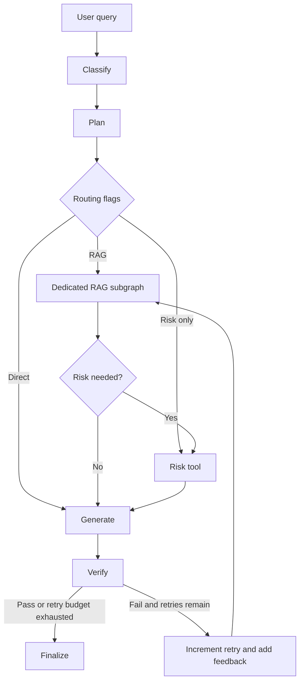
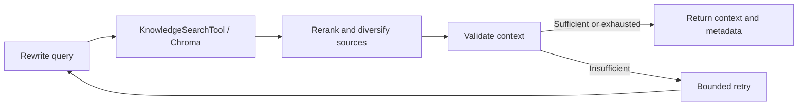

# Cybersecurity Incident Response Agent

A local Agentic RAG chatbot prototype for defensive incident triage, implemented with Python, LangGraph, Chroma, Streamlit and Ollama. No paid API is required.

[Assignment compliance](docs/REQUIREMENTS.md) · [Reviewer walkthrough](docs/DEMO.md) · [Functional evidence](reports/functional/evaluation_results.json) · [Load evidence](reports/load/load_test_results.json) · [Real-model smoke evidence](reports/ollama-smoke/evaluation_results.json)

## Problem, objective and users

Incident responders must combine incomplete descriptions with procedures under time pressure. A suspicious login, malicious attachment and customer-data export call for different evidence and containment steps. This assistant helps a responder classify the report, retrieve relevant local procedures, prioritize investigation and explain uncertainty.

Agentic RAG is useful here because conditional routing can skip unnecessary retrieval or risk scoring, dedicated nodes perform subtasks, and verification can request a bounded revision. Retrieved procedures support recommendations; a deterministic Python tool handles risk arithmetic. The assistant recommends actions but does not execute containment or contact external parties.

The supplied corpus is original **demonstration material**, not an authoritative incident-response standard. Outputs require analyst review.

## Docker quick start (recommended submission path)

Prerequisites: Git, Docker Desktop with Linux containers (or Docker Engine and Compose on Linux), internet access for the initial package/model downloads, and enough disk space for images and model volumes. The tested environment is Linux x86-64 under Docker Desktop with 15.25 GiB available to containers. CPU inference works; the 8B model needs several GB of RAM and can take minutes per query.

From a new checkout:

```powershell
git clone https://github.com/dravex01/cybersecurity-incident-response-agent.git
cd cybersecurity-incident-response-agent
docker compose up --build -d
docker compose exec ollama ollama pull qwen3:8b
docker compose exec app python -m app.rag.ingestion
```

Open [localhost:8501](http://localhost:8501). The sidebar should show the configured model and **40 knowledge chunks from 15 documents**. The first ingestion downloads the embedding model. Model downloads are explicit; no host Python environment or host Ollama installation is needed.

### Optional NVIDIA GPU acceleration

The base Compose file is CPU-compatible so reviewers without an NVIDIA GPU can run it. On a machine where Docker can access an NVIDIA GPU, layer the included GPU override on every Compose command:

```powershell
docker compose -f docker-compose.yml -f docker-compose.gpu.yml up --build -d
docker compose -f docker-compose.yml -f docker-compose.gpu.yml exec ollama ollama pull qwen3:8b
docker compose -f docker-compose.yml -f docker-compose.gpu.yml exec app python -m app.rag.ingestion
docker compose -f docker-compose.yml -f docker-compose.gpu.yml exec ollama ollama ps
```

After the first model request, `ollama ps` should report `100% GPU` or a CPU/GPU split under `PROCESSOR`. The override only grants the Ollama service GPU access; it does not change the model, RAG index or answer-quality settings. Use both `-f` arguments again for later `up`, `logs`, `exec` and `down` commands for that GPU-enabled stack. Docker Desktop on Windows requires WSL2 GPU support and a current NVIDIA driver.

Compose exposes the UI only on localhost. Ollama is reachable inside the Compose network at `http://ollama:11434`, so an existing host Ollama on port 11434 does not conflict. The UI health endpoint checks server availability; the sidebar additionally checks the exact model tag and index count.

```powershell
docker compose ps
docker compose logs --tail=50 app
docker compose down
docker compose up -d
```

Named volumes retain Ollama weights, the Hugging Face cache and Chroma. `down` retains them; `down -v` deliberately deletes them. A code change requires `docker compose up --build -d`. A change under `data/knowledge_base/` additionally requires ingestion after rebuilding. Dependencies are installed in a separate cached layer, so ordinary code changes do not redownload PyTorch.

Optional settings: copy `.env.example` to `.env` and edit it before starting. If `OLLAMA_MODEL` is changed, pull that exact tag with `docker compose exec ollama ollama pull YOUR_TAG`. After changing the embedding model, choose a new `COLLECTION_NAME` and ingest again; vectors from different embedding models must not be mixed.

The Dockerfile pins the Python base image by digest and the tested Python 3.12/Linux runtime in `requirements.lock`. It installs from source, runs `pip check`, includes Streamlit configuration, and runs as a non-root user. The lock targets Linux containers; Windows native development uses the project dependency ranges. Fresh builds still require access to package registries and model downloads. Model tags can change upstream; smoke-test metadata and the model inventory record the tested local artifacts. `docker-compose.gpu.yml` is an optional NVIDIA override; the default `docker-compose.yml` remains CPU-portable.

## Architecture and decisions



The main graph has **eight nodes**, independently of the RAG subgraph: `classify_query`, `plan_response`, `execute_knowledge_retrieval`, `risk_analysis`, `generate_answer`, `verify_answer`, `increment_agent_retry`, and `finalize_response`.

Classification returns validated intent, incident type and routing flags. Planning produces a per-query subtask list; the flags control which tool nodes actually execute. `AgentState` and `RAGState` are explicit TypedDicts storing intermediate results, flags, documents, scores, counters, errors, traces and timings. Nodes return partial state updates. Retries accumulate stage timings rather than overwriting earlier attempts.

Two integrated tools are `KnowledgeSearchTool.invoke`, called by the RAG retrieval node, and the non-retrieval `calculate_incident_risk`, called by the main risk node. Tools are local Python interfaces; no external write access is involved.

### RAG subgraph



The subgraph is compiled separately, callable on its own, and invoked from the main graph. It preserves original indicators when rewriting, retrieves up to twice `TOP_K` candidates (maximum 20), then selects up to `TOP_K` distinct source files. Source diversity reduces duplicate procedures, but can omit a useful second chunk from the same file; it is a deliberate compact-corpus trade-off.

The lightweight reranker uses 50% vector similarity and 50% token overlap, with bounded filename/incident-source bonuses. It avoids the memory and latency of a cross-encoder. Disabling it preserves vector order before source diversification. Its score and the context-validation heuristic are not calibrated probabilities.

Ingestion reads Markdown, text and text-based PDFs; scanned PDFs require OCR outside this prototype. Chunks default to 850 characters and 120-character overlap. Metadata includes filename, path, title, stable chunk ID and PDF page where present. Chroma persists cosine-similarity vectors locally. Updates upsert batches of 64, then remove obsolete IDs only after successful writes. Empty inputs or embedding failures do not erase the previous index; updates are not atomic, so re-run a failed ingestion.

The 15 source files cover phishing, malware/PowerShell, ransomware, credentials, suspicious login/MFA takeover, data exposure, unauthorized access, containment, evidence, recovery and escalation. Hungarian aliases support retrieval from Hungarian incident descriptions. English BGE embeddings work best with English retrieval queries, which the rewrite step helps produce; a multilingual model is a future alternative that requires re-indexing.

### Model and output quality

`qwen3:8b` is the default local model, served by Ollama. The trade-off is a capable 8B model with substantial CPU latency rather than paid remote inference. A smaller model reduces memory and generation time but needs a separate accuracy evaluation.

| Setting | Default | Purpose |
|---|---:|---|
| `OLLAMA_NUM_CTX` | 8192 | Limit context memory |
| `OLLAMA_NUM_PREDICT` | 1024 | Limit tokens per model response |
| `OLLAMA_TIMEOUT_SECONDS` | 600 | Per-request timeout for CPU inference |
| `OLLAMA_THINK` | false | Disable Qwen thinking mode |
| `TOP_K` | 5 | Maximum distinct retrieved sources |
| `MAX_AGENT_RETRIES` | 2 | Maximum answer revision rounds |
| `MAX_RAG_RETRIES` | 1 | Maximum retrieval revisions per subgraph call |

Each model call has a timeout and the graph has bounded retries; these are not a global ten-minute deadline. A slow model and repeated revisions can take longer overall. The UI shows completed-node progress during analysis.

Generation targets a concise response with explicit uncertainty. Code supplies classification, the risk decision and the actual retrieved source list, replacing generated decision/source sections. The verifier combines a model judgment with deterministic required-section and filename checks. Unknown filenames cannot be approved merely because the model says they are valid. These checks do not prove that every claim is supported by its source.

Classifier confidence and model-verifier scores are self-estimates, not empirically calibrated probabilities. The same local model generates and judges the answer, so the verifier is not an independent reviewer.

General guidance shows **Not calculated**, not a fabricated 0/100 risk. Structured model decisions must include every field. Risk extraction requests a verbatim incident excerpt for each factor, rejects quotes absent from the input, and retains accepted excerpts for analyst review. Risk extraction failure raises a visible error instead of silently returning Low. Malformed classifier/rewrite/verifier output has explicit fallback behavior; exhausted verification retries produce a warning.

### Deterministic risk policy

| Factor | Weight |
|---|---:|
| Malware execution | 20 |
| Privileged account | 20 |
| Sensitive data exposed | 30 |
| External access | 15 |
| Credential compromise | 20 |
| Lateral movement | 25 |
| Critical asset | 20 |
| Ransomware indicators | 70 |

The sum is capped at 100: **Low 0–19, Medium 20–39, High 40–69, Critical 70–100**. The explanation lists contributing factors; the UI separates model evidence from keyword-recovered factors. The arithmetic is deterministic, but a quote's presence does not prove that it semantically supports its factor. Model interpretation and keyword recovery can still be wrong, especially for negation and hypothetical descriptions. This is a transparent prototype policy, not an industry-standard severity model or a confirmation of compromise.

## Evaluation and performance evidence

The submitted mini-set contains **20 cases**: 15 original English cases, two Hungarian regressions, an unrelated query, an ambiguous login and quoted prompt injection. It meets the assignment's 10–20 question range. The load runner accepts 50–200 requests; the submitted scenario uses **100 requests and four workers**.

Raw JSON/CSV evidence is committed under `reports/`. It includes provider mode, timestamp, Python/package versions, relevant settings, code/dataset hashes and individual results. Evaluation JSON also retains answers, traces, verifier feedback, timings and errors. New ad-hoc measurements default to ignored `results/`.

Functional metrics include classification, retrieval hit rate, risk agreement on risk-required cases, concept coverage, cited-filename precision and end-to-end success. The English and Hungarian external customer-export cases additionally require exactly 45/100; excessive risk no longer passes as a conservative estimate. General guidance and unrelated cases explicitly expect no risk. Concept checks accept alternative English/Hungarian terms for bilingual cases. End-to-end success requires the expected classification/routing properties, concept threshold, valid filenames and a passed verifier. Exceptions remain failed rows instead of aborting the dataset.

**Dummy-model results measure development regressions, not Qwen answer accuracy.** The fake provider uses keyword rules, repeats retrieved text in its answer, and uses a fixed grounding heuristic. A high concept score or grounding score in that mode is not independent evidence of semantic correctness. The dataset is small, synthetic and used during development, not held out.

The load test reports completed requests separately from verifier failures, excluded warm-up time, min/max/mean/median/p95/p99, throughput and mean stage timings. Stage means use all requests (skipped stages contribute zero), so they can be compared with mean total latency. A completed request is not necessarily a correct answer. The p95/p99 estimator uses the lower order statistic of the sorted sample.

The 2026-09-05 Docker run used Python 3.12.14, real BGE embeddings and Chroma, with FakeLLM for reproducible workflow checks:

| Functional metric | Result |
|---|---:|
| Cases passing the stated end-to-end predicate | 20/20 |
| Classification / retrieval hit / eligible risk agreement | 100% / 100% / 100% |
| Required-concept coverage | 95.0% |
| Cited-filename precision | 100% |

| Load metric (100 requests, four workers) | Result |
|---|---:|
| Completed / failed / failed verification | 100 / 0 / 0 |
| Mean / median | 320.3 / 334.4 ms |
| p95 / p99 | 423.4 / 452.0 ms |
| Min / max | 3.0 / 475.0 ms |
| Throughput / measured wall time | 12.35 requests/s / 8.09 s |
| Excluded warm-up | 14.14 s |

Mean retrieval time is 312.0 ms per request, about 97.4% of mean latency in this dummy-model scenario. Loading the embedding model is a separate cold-start cost. Cache repeated normalized-query embeddings/results to target retrieval overhead; compare a smaller local LLM or reduced context on identical cases to target real inference. These are optimization proposals, not measured speedups. The mixed workload includes five direct out-of-scope responses, explaining the low minimum latency.

See [measured results and bottleneck analysis](reports/README.md) for raw evidence, the separate real-model smoke test and limitations.

The final **real `qwen3:8b` smoke test passed 2/2 cases** under the stated predicate: customer-data export scored **High 45/100**, and general guidance correctly had **no risk score**. CPU latency was **978.24 s (16 min 18 s, two revisions)** and **291.59 s (4 min 52 s, no revision)**. Concept coverage was 83.3%; the general answer omitted an explicit lessons-learned point. This is limited development evidence, not proof of uniformly correct answers. Prepare a live demo in advance; do not expect dummy-benchmark response times from the 8B model.

### Reproduce measurements

```powershell
docker compose exec app python -m evaluation.evaluate
docker compose exec app python -m load_tests.load_test --requests 100 --workers 4
docker compose exec app python -m evaluation.evaluate --real-llm --case-id breach_01 --case-id general_01 --output-dir results/ollama-smoke
docker compose cp app:/app/results ./results-from-docker
```

Omit `--case-id` for all 20 real-model cases. `--real-llm --workers 1` on the load runner runs actual local-model load; it can take hours on CPU. The submitted 100-query dummy benchmark is intentionally not presented as that measurement.

## UI and demo

Streamlit displays readiness, a chat, live main-node progress, execution trace, timings, retrieved excerpts and scores, deterministic risk and verifier details. Each turn is independent: displayed history is not sent back as incident memory. The clear-conversation button clears the current session. Inputs are limited to 8,000 characters; describe the incident concisely rather than pasting raw log archives.

Follow the [reviewer walkthrough](docs/DEMO.md). Suggested questions:

- An external account downloaded a customer data export from cloud storage.
- Egy külföldi IP-ről sikeres belépést és új MFA-eszközt látunk.
- A Word attachment launched PowerShell. What should we do?
- Describe the main phases of handling a cybersecurity incident.

## Native development and tests

Python 3.11 or 3.12 and a running host Ollama are required for native use:

```powershell
Copy-Item .env.example .env
python -m venv .venv
.\.venv\Scripts\Activate.ps1
python -m pip install -e ".[dev]"
ollama pull qwen3:8b
python -m app.rag.ingestion
python -m streamlit run app/ui/streamlit_app.py
python -m pytest --cov=app --cov-report=term-missing
python -m ruff check .
```

On Bash use `cp .env.example .env` and `source .venv/bin/activate`. Native dependency resolution may differ from the pinned Linux container; use Docker for the reference environment. The Streamlit configuration disables the optional-module file watcher and usage statistics.

The deterministic tests need no running Ollama, downloaded model or GPU. They cover graph paths, retries, risk boundaries, source metadata, ingestion failure preservation, exact model-tag health, fabricated-source rejection, metric semantics, cumulative timing and the Streamlit chat via AppTest. GitHub Actions installs the pinned Linux runtime, runs tests/lint, validates Compose and builds/health-checks the Docker image. CI does not download an LLM or run the real-model benchmark.

Submission verification: **33 tests passed** on both Windows/Python 3.11 and Linux/Python 3.12, with **86% statement coverage** of `app/`. Ruff and `pip check` passed. A fresh empty index ingestion produced the expected 40 chunks. These checks cover the prototype contract rather than every possible incident or model response.

## Repository layout

```text
app/                 main agent, RAG subgraph, tools, model providers and UI
data/knowledge_base/  original demonstration corpus
evaluation/          20 cases, metrics, runner and measurement provenance
load_tests/          configurable 50–200 request runner
tests/               unit, integration and Streamlit tests
docs/                assignment compliance map and demo walkthrough
reports/             committed raw measurements and interpretation
results/             ad-hoc generated measurements (ignored)
storage/             local vector database (ignored)
.github/workflows/   automated tests and Docker build check
```

## Limitations and next steps

This is a single-user take-home prototype without authentication, tenant isolation or action execution. Source text and user input are untrusted; prompt instructions and output checks reduce some failures but do not provide comprehensive injection resistance. Evidence handling, scope, remediation and notification decisions require an authorized responder. No secrets or unnecessary personal data should be entered.

The strongest next steps are a genuinely held-out bilingual evaluation with human review, improved negation/uncertainty handling in factor extraction, model/version-specific evaluation, and transactional index updates. Performance proposals are to cache repeated-query embeddings/results and compare a smaller model or shorter context on the same cases and hardware; neither improvement should be claimed without before/after measurements.
